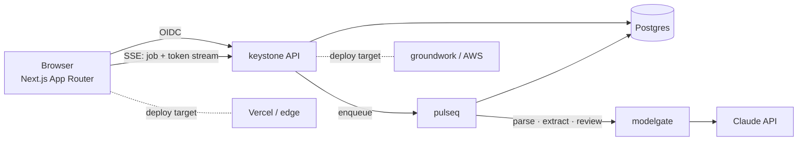

# taskdeck

> A full-stack product that ties the portfolio together: a team workspace for
> running background jobs and AI-assisted document review, built on `keystone`
> for the API, `pulseq` for async work, and `modelgate` for the AI features.

[](#)
[](LICENSE)

**Live demo:** _pending_

---

## Why this exists

The other repos are components. `taskdeck` is a real application that uses them,
so the whole thing reads as a system rather than five disconnected demos. It's a
small SaaS-shaped app: sign in, upload documents, kick off long-running
processing and AI review, watch jobs progress in real time, see results.

## What it demonstrates

- **Full-stack delivery** — Next.js (App Router) front end, typed end-to-end
  against the API, built to deploy on Vercel with the backend on `groundwork` /
  AWS (see the architecture diagram below).
- **Real-time UI** — job progress and streamed AI output over SSE / WebSocket,
  optimistic updates, reconnect handling.
- **Auth done once** — OIDC login via `keystone`, session handling, protected
  routes, org / role-aware UI.
- **Async workflows** — uploads enqueue `pulseq` jobs (parse → extract →
  AI review); the UI reflects each stage.
- **AI features** — document Q&A and summary powered by `modelgate`, with
  citations shown in the UI.
- **Product polish** — empty states, error boundaries, loading skeletons,
  keyboard nav, light/dark, responsive.
- **Testing** — component tests (Testing Library), end-to-end tests (Playwright)
  covering the core flow.

## Architecture



## Tech stack

| Layer     | Choice                                                  |
| --------- | ------------------------------------------------------- |
| Front end | Next.js 15, React, TypeScript, Tailwind, TanStack Query |
| Realtime  | SSE for streams, WebSocket for presence                 |
| Auth      | OIDC via `keystone`                                     |
| Backend   | `keystone` (API), `pulseq` (jobs), `modelgate` (AI)     |
| Tests     | Vitest + Testing Library, Playwright e2e                |
| Deploy    | Front end on Vercel, services via `groundwork`          |

## Getting started

```bash
git clone https://github.com/ingo4it/taskdeck.git
cd taskdeck
cp .env.example .env.local
docker compose up -d          # brings up keystone, pulseq, modelgate, postgres
pnpm install
pnpm dev
open http://localhost:3000
```

A seed script creates a demo org, user, and sample documents so the app is
non-empty on first run.

## Project layout

```
app/              routes (App Router), server actions
components/        UI components + stories
lib/
  api/            typed client for keystone
  realtime/       SSE + WS hooks
  auth/           OIDC session helpers
e2e/              Playwright specs (core flow)
docker-compose.yml  full local stack
docs/adr/         architecture decision records
```

## Design notes

ADRs in [`docs/adr/`](docs/adr/):

- ADR-001 — SSE for one-way streams, WebSocket only where bidirectional is needed
- ADR-002 — Server actions vs. a dedicated BFF layer
- ADR-003 — Optimistic updates + reconciliation strategy for job state

## Roadmap

- [ ] Multi-file batch review with per-file progress
- [ ] Shareable read-only result links
- [ ] Audit log view
- [ ] Offline-friendly PWA shell

## License

MIT © Frank Rao — [frankrao.com](https://frankrao.com)
