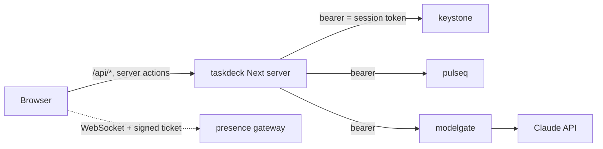
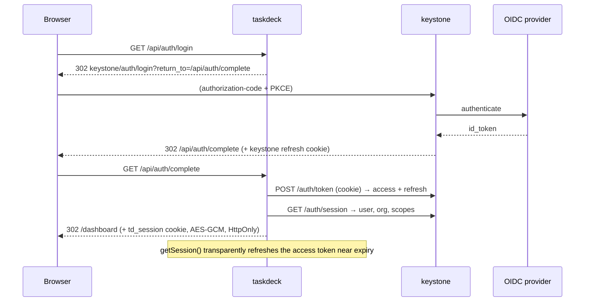

# Architecture

## Shape

```
app/
  layout.tsx              ThemeProvider + QueryProvider
  page.tsx                session? → /dashboard : /login
  login/page.tsx          CTA → /api/auth/login
  error.tsx not-found.tsx  global boundaries
  api/
    auth/{login,complete,logout}/route.ts   OIDC handoff with keystone
    documents/route.ts                       GET list · POST create (+ start pipeline)
    documents/[id]/route.ts                  GET · DELETE
    documents/[id]/pipeline/stream/route.ts  SSE proxy → pulseq
    documents/[id]/ask/route.ts              SSE proxy → modelgate
    documents/[id]/presence-ticket/route.ts  signed WS ticket
  dashboard/
    layout.tsx             requireSession() + AppNav
    page.tsx               server-fetch first page → <DocumentsView>
    documents/[id]/page.tsx  server-fetch doc + pipeline + review → live components
    actions.ts             server actions (form-driven mutations)
components/
  ui/                      Button, Card, Badge, Skeleton, EmptyState, Spinner
  documents/               DocumentsView (client) · DocumentCard · UploadForm
  jobs/                    JobPipeline (client, SSE) · StageBadge
  ai/                      ReviewPanel · AskBox (client, SSE) · CitationList
  presence/PresenceBar     client, WebSocket
  layout/AppNav            + ThemeToggle + LogoutButton
lib/
  env.ts                   zod-validated server vs public env
  api/                     client (retry/backoff, problem+json) · index (backend gateway) ·
                           route (authed() wrapper) · types · errors
  auth/                    crypto (AES-GCM cookie) · session (getSession/requireSession, refresh)
  realtime/                sse (fetch-based reader + reconnect) · useJobStream ·
                           useAnswerStream · usePresence
  query/                   provider · documents (optimistic hooks)
e2e/                       Playwright core-flow + mock-backend fixture
```

## Request paths



The browser holds **no upstream credential**. Every call goes through this
app's server layer, which reads the encrypted session cookie and attaches the
keystone access token (ADR-0002).

## Auth



## Realtime

| Feature           | Transport            | Hook              | Notes                                                                  |
| ----------------- | -------------------- | ----------------- | ---------------------------------------------------------------------- |
| Pipeline progress | SSE (`fetch` reader) | `useJobStream`    | reducer folds stage events; reconnect w/ backoff; server-rendered seed |
| AI answer         | SSE                  | `useAnswerStream` | single request, no reconnect; abort → modelgate stops billing          |
| Presence          | WebSocket            | `usePresence`     | signed 60s ticket; heartbeats; roster broadcast (ADR-0001)             |

## Data flow for one upload

1. `UploadForm` → `useUploadDocument` mutation → `onMutate` inserts an
   `optimistic-…` row and snapshots the list cache.
2. `POST /api/documents` → `backend().documents.create` (keystone) →
   `backend().pipeline.start` (pulseq).
3. Success → invalidate list; the real row replaces the placeholder. Failure →
   snapshot restored, error shown (ADR-0003).
4. Opening the document mounts `JobPipeline`, which subscribes to the pulseq SSE
   stream and shows each stage completing; when `review` finishes, the
   server-rendered `ReviewPanel` has the modelgate result and `AskBox` can
   stream answers.
